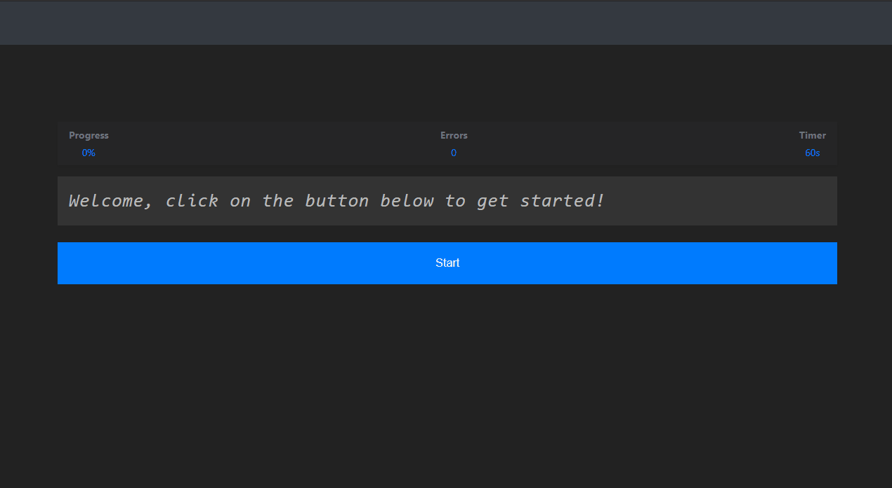

# React TypeScript one-minute speed typing test

> A simple one-minute React app for testing your typing speed.

<p align="center">
  
</p>

### Instructions

- Download or clone the repo:

```bash
git clone https://github.com/awran5/react-one-minute-speed-typing-test-ts.git
```

- Install

```bash
# npm
npm install

# Yarn
yarn install
```

### v2.1.0 Changelog 11/15/2022

- Updated: dependencies
- Added: github icons
- Added: `CPM` state
- Modified: Refactor style
- Fixed: Minor bugs

### v2 Changelog 09/17/2021

- Updated: dependencies
- Added: light/Dark mode
- Added: eslint airbnb style
- Modified: Refactor state to useReducer
- Fixed: Minor bugs

- none

### [Live Example](https://react-one-minute-speed-typing-test-ts.vercel.app)

<br />

[](https://codesandbox.io/s/react-one-minute-speed-typing-test-ts-q82ux?fontsize=14&hidenavigation=1&theme=dark)

### License

MIT © [awran5](https://github.com/awran5/)
